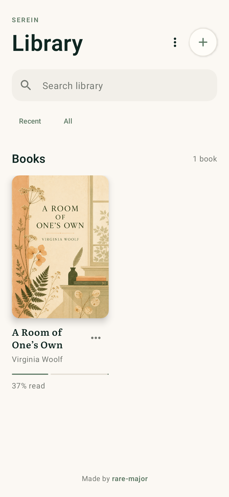
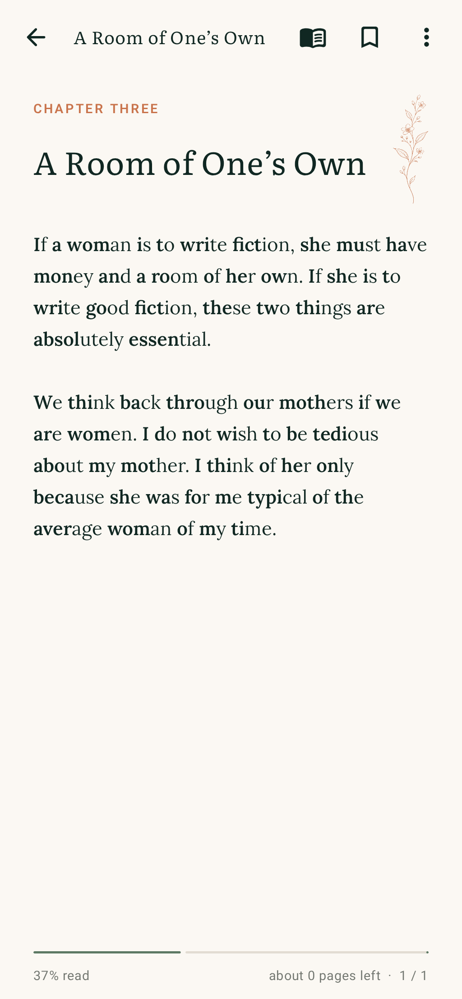
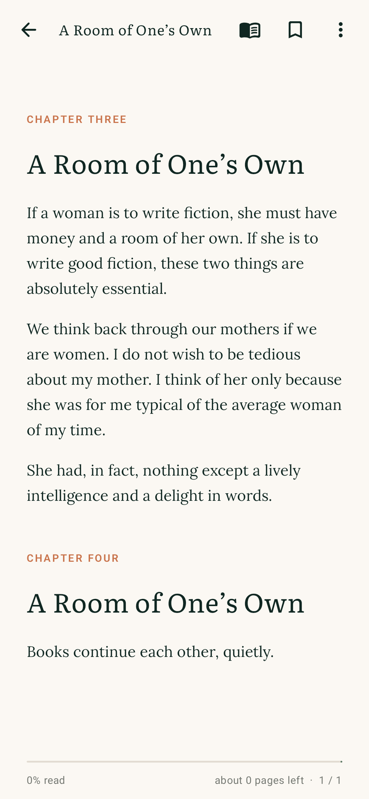
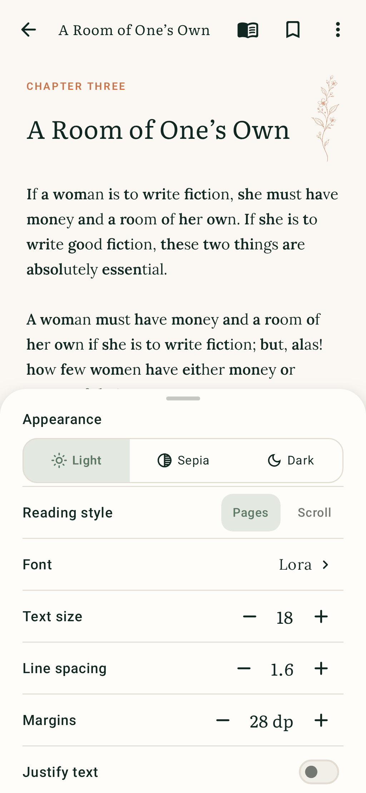
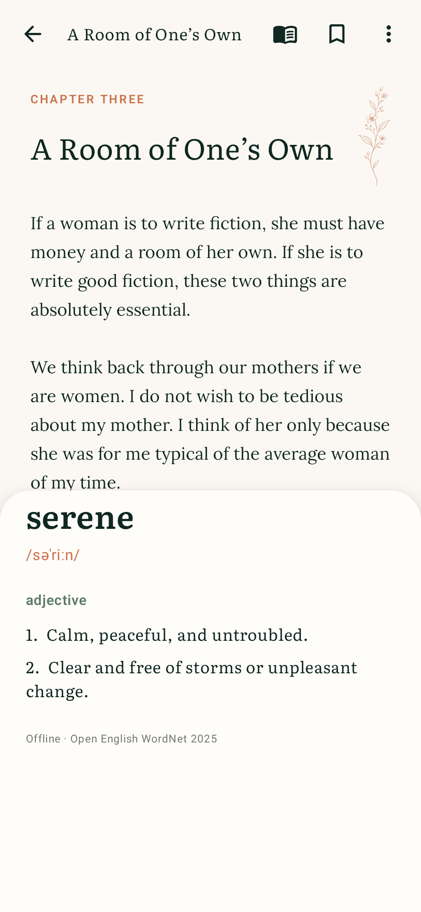
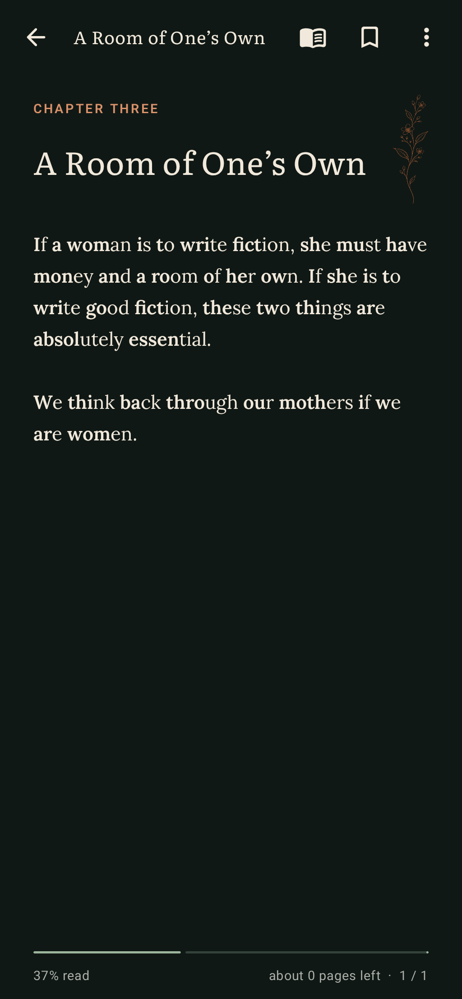
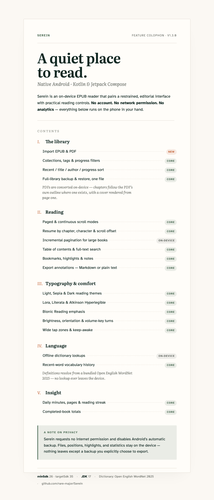

# Serein

Serein is a native Android EPUB reader built with Kotlin and Jetpack Compose. It pairs a quiet editorial interface with practical local reading controls. Its visual system applies Apple-inspired principles—purpose, simplicity, hierarchy, consistency, and craft—through native Android patterns rather than copying iOS chrome.

## Screenshots

| Library | Paged reader | Scrolling reader |
| --- | --- | --- |
|  |  |  |

| Reader settings | Offline dictionary | Dark theme |
| --- | --- | --- |
|  |  |  |

All six states are rendered at 390 × 844 dp by the Compose screenshot test suite (see [Verification](#verification)) — what you see above is what ships, not a mockup.

## Features at a glance

## What works

- Import EPUB or PDF files with Android's system document picker.
- Extract EPUB metadata, reading order, headings, lists, quotations, chapter images, and embedded cover art.
- Convert an imported PDF into an EPUB entirely on-device: chapters follow the PDF's own outline when it has one (falling back to fixed-size page chunks), a cover thumbnail is rendered from the first page, and the result is added to the library like any other book.
- Keep a searchable on-device library with collections, tags, progress filters, and recent/title/author/progress sorting.
- Resume every book from its saved chapter, character position, and scroll offset.
- Read in reflowed page mode or continuous scrolling mode.
- Open large books quickly with incremental pagination that measures only nearby pages, and chunk oversized paragraphs to keep continuous scrolling responsive.
- See percentage read, an estimated reading time remaining based on your own pace this session, pages remaining, and current/total layout pages in a quiet footer.
- Adjust page margins and turn on full text justification.
- Navigate with a table of contents and full-book text search.
- Tap a link on a book's own Index or Contents page to jump straight to the chapter or heading it points to.
- Add persistent bookmarks and jump back to them from the Saved panel.
- Long-press text to save word or sentence highlights, attach notes, and export annotations as Markdown or plain text.
- Look up selected English words entirely offline with the bundled Open English WordNet database, and keep recent words in vocabulary history.
- Switch between Light, Sepia, and Dark reading themes.
- Choose Lora, Literata, or Atkinson Hyperlegible.
- Increase or decrease reading size.
- Enable Bionic Reading, which bolds the first 50% of each word (rounding up for odd-length words) only as pages enter the reading viewport.
- Tap reading text to hide or reveal the top controls.
- Adjust in-reader brightness, lock orientation, keep the screen awake, widen tap zones, and optionally turn pages with the volume buttons.
- View daily reading time, pages read, reading streak, and completed-book totals.
- Back up and restore the library, EPUB files, covers, progress, annotations, settings, vocabulary history, and statistics as one Serein backup.
- See a brief launch splash with the Serein mark, then open the creator credit to visit [rare-major](https://github.com/rare-major) on GitHub.
- Remove imported books, their local files, bookmarks, and highlights.

The app includes a small built-in sample so the reader experience is visible on first launch. Imported files, reading positions, bookmarks, highlights, notes, preferences, dictionary lookups, and statistics stay on the device. Dictionary definitions are resolved locally from Open English WordNet 2025. Serein requests no network permission and disables Android automatic backup; data leaves the app only when the user explicitly chooses an annotation or Serein-library backup destination.

## Build

Requirements:

- JDK 17
- Android SDK 35

Debug builds use the separate `com.serein.reader.debug` application ID and are for development only:

    ./gradlew assembleDebug

Never distribute `app-debug.apk`. To create an end-user release, provide the dedicated signing key through these environment variables:

    SEREIN_RELEASE_KEYSTORE
    SEREIN_RELEASE_STORE_PASSWORD
    SEREIN_RELEASE_KEY_ALIAS
    SEREIN_RELEASE_KEY_PASSWORD

On this development machine, `tools/build_release.sh` reads the release password from macOS Keychain, runs unit tests and release lint, builds and verifies the signed APK, and writes:

    ./tools/build_release.sh
    Serein-android-release.apk

The release task fails closed when signing credentials are missing. Preserve the release keystore and password: every future update must use the same signing identity.

If an older Serein debug APK is installed, create a manual Serein library backup first, then uninstall it before installing the release. Android will not update a debug-signed package with a differently signed release package.

## Verification

    ./gradlew testDebugUnitTest
    ./gradlew lintDebug
    ./gradlew validateDebugScreenshotTest

Release verification additionally checks that the APK is signed by the dedicated Serein certificate, is not debuggable, contains no Compose debug activities, requests no internet permission, and has a nonempty R8 mapping.

The screenshot suite renders the library, paged reader, scrolling reader, open reader-settings, dictionary, and dark-reader states at 390 × 844 dp.

## Reading gestures

- Swipe horizontally or tap the page edges to turn reflowed pages.
- Tap reading text to hide or reveal the reading controls.
- Long-press a word to define it, highlight the word, or highlight its sentence.
- Use the book icon for contents; the overflow menu contains search, saved annotations, vocabulary history, reading mode, and typography/device settings.

Page counts are layout-dependent estimates and recalculate when the device size, font, font size, or line spacing changes. Pages are generated incrementally around the current position instead of laying out the whole book up front. Bionic emphasis is applied only to visible content without repaginating the book. Serein resumes from the stored logical text position after a reflow.

## Brand assets

- Logo master: `design/serein-logo-master.png`
- Reproducible generation prompt: `design/serein-logo-prompt.md`
- Android adaptive and density-specific launcher assets: `app/src/main/res/mipmap-*`

## EPUB support

Serein reads standard, unencrypted EPUB 2 and EPUB 3 packages whose chapters are XHTML documents. It preserves common reflowable semantics and images; fixed-layout, DRM-protected, scripted, or heavily malformed books may not render as intended.

## PDF import

PDF import recovers the text layer only, entirely on-device with no network access. Scanned or image-only PDFs and password-protected PDFs have no extractable text layer and are rejected with a clear message rather than imported as an empty book.
